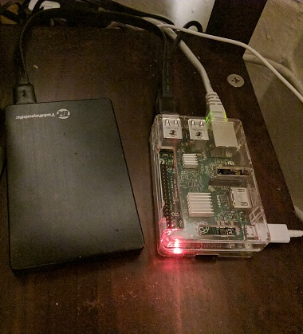

# Raspberry Pi File Server Walkthrough

## Contents
[The Initial Setup](#the-initial-setup) | [Install Required Software](#install-required-software) | Setup File Shares | Access File Share from Client Devices

A Raspberry Pi 2 running Raspbian, based on Debian 8 "Jessie". It is attached to a standard 2.5 inch HDD and a 3.5 inch HDD (not shown). For maximum throughput, it is connected via ethernet to the local network.

## The Initial Setup

This guide has been developed and tested on a Raspberry Pi 2 running Raspbian, based on Debian 8 “Jessie”. The Raspberry Pi Foundation’s website [(link)](https://www.raspberrypi.org/downloads/noobs/) has an easy to setup installer called NOOBS, short for New Out Of the Box Software. For this setup, you will need to connect your Raspberry Pi to a power source (capable of at least 2A, especially for directly connected hard drives), a monitor, mouse and keyboard. Advanced users can proceed using SSH, if setup on their system.

Once you complete this tutorial, you will be able to access files stored on your Raspberry Pi through your smartphone or computer (compatible with Android, iOS, Windows, Linux, macOS).

## Install Required Software
